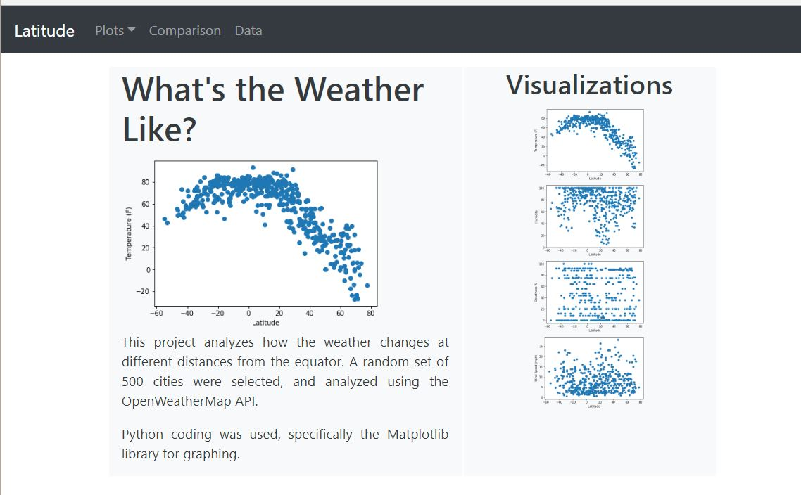

# Weather vs Latitude Website

This analysis compares how weather changes across different latitude points. A random selection of 600 cities is selected by latitude and longitude. Because we are dealing with points on a sphere, I looked at http://mathworld.wolfram.com/SpherePointPicking.html as a resource to find how to find cities in a truly random way. The OpenWeatherMap API was then used to get weather data.

This repo contains the html files for the [Weather vs Latitude Website](https://syverts1.github.io/Weather_Latitude_Website).

The website is built off a bootstrap framework to showcase the work done in the [Weather vs Latitude Analysis](https://github.com/Syverts1/Weather_Latitude_Analysis).
